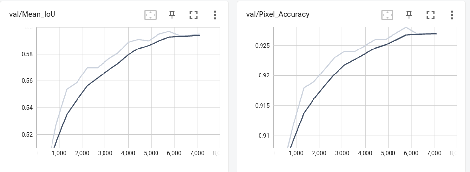

# heirarchical_segmentation

Реализация семантической сегментации, с иерархической сегментацией классов

За основу baseline решения взят https://github.com/yassouali/pytorch-segmentation

Для задачи сегментации, испольуется 7 классов со следующей иерархией

```
├── (0) background
└── body
    ├── upper_body
    |   ├── (1) low_hand
    |   ├── (6) up_hand
    |   ├── (2) torso
    |   └── (4) head
    └── lower_body
        ├── (3) low_leg
        └── (5) up_leg
```

Были разработаны:

Модуль чтения датасета: src/pascal_data.py

Модуль тренировки: train_pascal.py

Модель инферентса: predict.py


В модуле, train_pascal.py, описано измнение метода расчета метрик класса TrainerPascal, измен метод расчета метрики Mean_IoU:

* Реализован расчет метрики mIoU<sup>0</sup> - `body`- который усредняет показатель метрики по классам 1-6
* Реализован расчет метрики mIou<sup>1</sup> - `upper_body`, `lower_body`- Представлены как метрика "Mean_IoU_upper_body" и "Mean_IoU_lower_body"
* Реализован расчет метрики mIou<sup>2</sup> - Представлен расчет метрики mIoU по каждому классу отдельно, представлены как метрика Class_IoU

За основу и максимизацию на валидации взята метрика mIoU<sup>0</sup>

При этом background класс не учитывается при рассчете метрики.


В качестве тестирования была обучена архитектура UpperNet с бэкбоном resnet101.




Обученная модель выложена на ya.disk: https://disk.yandex.ru/d/a5wFPsMFdRia8A


Скрипт для тренировки:

```
python train_pascal.py
```

Скрипт для инференса:

```
python predict.py
```

